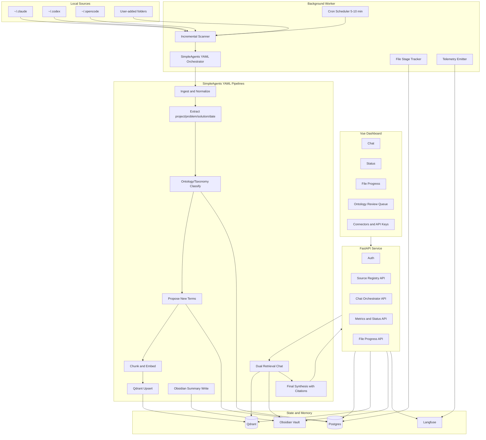
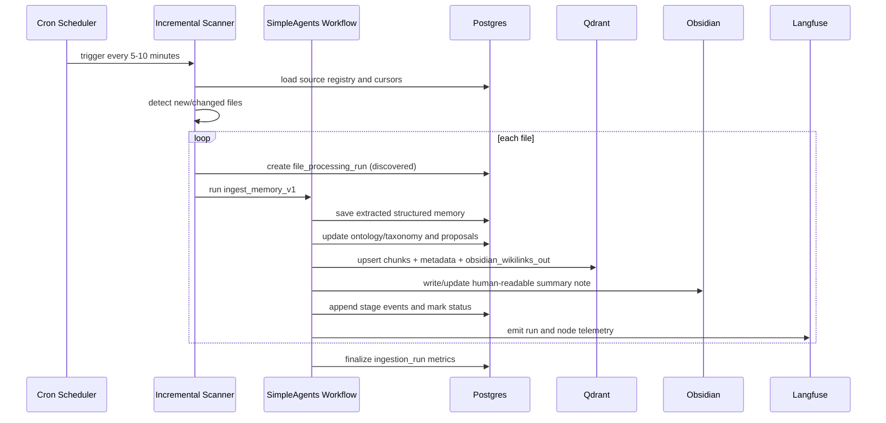
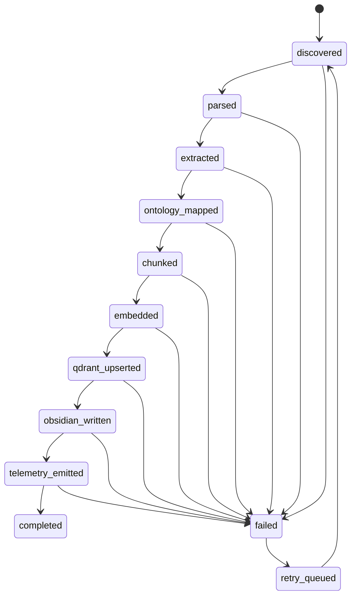
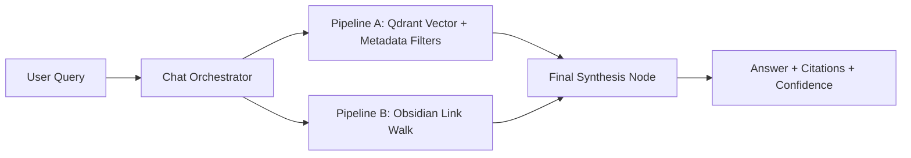

# Memory Evolutionary Agents - Architecture

This document defines the v1 system architecture for ingesting local agent session data, evolving memory schemas, and serving searchable memory through Qdrant, Obsidian, and a web portal.

## System Overview

## Runtime Flow (Ingestion)

## File Processing State Machine

## Chat Retrieval Orchestration

## Service Boundaries

- `FastAPI API`: authentication, source configuration, chat APIs, metrics and status endpoints.
- `Worker`: cron jobs, workflow execution, retries, stage tracking, and telemetry emission.
- `Postgres`: source registry, run history, file progress, ontology/taxonomy/relation registry, model pricing, encrypted connector secrets.
- `Qdrant`: vector search and metadata filtering with mirrored Obsidian link fields.
- `Obsidian Vault`: human-readable memory notes and wikilink graph.
- `Langfuse`: trace-level observability and token-cost telemetry correlation.
